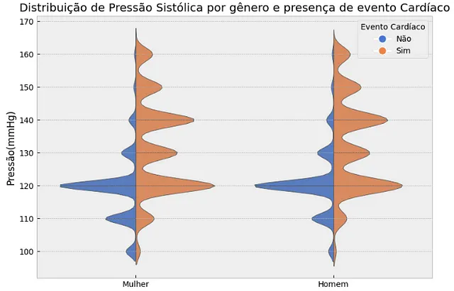

# Análise Exploratória de Dados de Marcadores de Problemas Cardiovasculares

# Resumo
Através de uma base de dados pública e usando de técnicas de analise de dados como ETL, conseguimos indicar quais fatores tem relação com o desenvolvimento de problemas cardiovasculares. Analisando as variáveis em contexto conseguimos responder a algumas perguntas comuns nesse tipo de ensaio. 

# 1. O Problema
Doenças cardiovasculares (DCV) são um grupo de doenças do coração e dos vasos sanguíneos, onde são exemplos o infarto, arritmia, Acidente Vascular Cerebral, Insuficiência cardíaca entre outros.

Estima-se que apenas no Brasil elas sejam responsável por mais de 300 mil mortes ao ano. A nível mundial esse número chega a 17,9 milhões, representando 32% do total de mortes.

Entre os principais fatores de predisposição a desenvolver uma DCV estão:

- Histórico familiar: Pessoas com familiares que sofreram ataques cardíacos ou AVCs apresentam maior risco.
- Hábitos de vida: Tabagismo, sedentarismo, dieta rica em gorduras saturadas e trans, consumo excessivo de sal e álcool são fatores de risco modificáveis.
- Condições crônicas: Hipertensão, diabetes, colesterol alto e obesidade aumentam o risco de DCVs.
- Idade: O risco de DCVs aumenta com a idade.
- Sexo: Homens geralmente apresentam maior risco de DCVs do que mulheres antes dos 65 anos, porém após essa idade, a incidência se torna semelhante em ambos os sexos.

# 2. Explorando os dados

Utilizaremos as bibliotecas do Python, Pandas, Numpy, Seaborn e Matplotlib para trabalhar e mostrar os dados.

Os dados analisados abaixo foram retirados do site Kaggle e apresentavam as colunas e linhas como o exemplo abaixo:

Nota-se a presença da última coluna "cardio" que representa valores 0 e 1, onde 0 significa AUSÊNCIA de problemas cardiovascular e 1 PRESENÇA de problemas cardiovasculares.

## 2.1 Alterando e criando colunas
Como pode-se perceber, a coluna age está composta por dias o que atrapalha a visualização. Fizemos uma tranformação para anos, apenas dividindo-a por 365 e arredondando sempre para menos.

Quando utilizamos altura e peso de forma separadas, eles trazem pouca informação a um dataset como esse. Sabe-se, pela literatura, que o fator entre ambos elevado indica maior predisposição a problemas cardíacos. Esse fator é o que chamamos de IMC (ou BMI em inglês), Índice de Massa Corporal. Assim, calculamos e criamos uma coluna para esse dado.

## 2.2 Trabalhando com outliers
Para analisar a presença de outliers (valores muito discrepantes da média verificada pelo restante dos dados) podemos utilizar uma função do pandas "describe":

Ao analisarmos os dados podemos verificar que as colunas height, weight, ap_hi e ap_lo tem valores muito discrepantes e alguns até impossiveis. Por exemplo, o menor valor da coluna ap_hi é negativo, o que é impossível por se tratar da medida de pressão arterial.

Já outros valores, como o menor valor para ‘height’(55cm) não condiz com a premissa de que os indíviduos aqui listados são todos adultos. Assim como o menor valor para a coluna ‘weight’ (10kg).

Por isso retiramos os outliers já que eles representavam menos de 6% do total do dataset. Marcamos como outliers os valores maiores que 97,5% do percentis e menores que 2,5%.

## 2.3 Distribuição dos dados
Para uma análise correta de um dataset faz-se necessário olhar para a distribuição de todas as variáveis e suas relações com a variável alvo (‘cardio’).

Vemos uma distribuição quase normal para todas as variáveis numéricas, com leve “assimetria positiva” da variável BMI, caracterizada por essa ‘cauda’ prolongada a direita. Isso mostra que apesar da média estar próxima ao valor de 25, há uma distribuição maior de casos maiores que 25 do que menores.

Nesses gráficos percebemos a maior quantidade de mulheres no dataset, bem como a quantidade de pessoas com colesterol e glicemia dentro do normal, não fumantes, que não bebem e que praticam atividade física.

## 2.2 Distribuição dos dados em relação a variável target("cardio")
Ao relacionar as variáveis númericas com a variável-alvo (target) chegamos a algumas verificações interessantes:

Veja que na maioria das colunas os valores médios para o grupo com doença cardíaca é maior (bem representado pela linha dentro do quadrado, que indica a mediana da amostra). Com destaque para a coluna ap_lo (pressão arterial sistólica) que deixa de ter outliers superiores pelo aumento da média e mediana.

# 3. Respondendo perguntas com os dados
Ao analisarmos um conjunto de dados podemos responder algumas perguntas que podem surgir e que servem para elucidar o caso de problema. Para isso precisamos tomarmos o cuidado de não inferir ou supor fatos que não estão nos dados e que não podem ser comprovados por eles.

## 3.1  “Há relação direta entre idade e incidência de problemas cardíacos?”

Vemos que os dados mostram que SIM. Há uma relação direta entre idade e incidência dos DCVs. O gráfico de barras mostra uma inversão na quantidade de não doentes para doentes após 55 anos.

## 3.2 “Há relação direta entre pressão arterial e problemas cardíacos?”

Novamente, SIM. Utilizamos um gráfico de boxplot mostrando a distribuição das pressões diastólica (ap_hi) e sistólica(ap_lo) nos 2 grupos “target”. Verifica-se que em ambas o terceiro quartil do grupo não-DCV é o ponto onde fica o primeiro quartil do grupo DCV, um deslocamento para cima. Além disso, fica fácil mostrar a diferença entre a mediana dos dois grupos.

O gráfico abaixo evidencia esse fato, usando um “violinplot” da distribuição das pressões sistólicas por gênero e por grupo. Repare no deslocamento da distribuição à direita para valores maiores de pressão sistólica, em ambos os gêneros.

## 3.3 "Há uma relação direta entre o BMI (Body Index Mass) e problemas cardíacos?"

Há uma relação direta. Tanto nesse gráfico de distribuição como no violinplot abaixo vemos uma concentração de valores maiores de BMI para o grupo com DCV.

O que também chama a atenção no gráfico acima é o violinplot mais “alongado superiormente” para o grupo Mulher, mostrando maior quantidade de valores altos de BMI (> 40) do que no grupo Homem.

## 3.4 "Há uma relação direta entre o valor de colesterol sanguíneo e problemas cardíacos?"

Os dados mostram que SIM. Sendo um achado há muito discutido e documentado na literatura, aqui também fica evidente por esse gráfico. Os dados que relataram valores maiores “Above Normal” (Acima do normal) e “Well Above Normal” (Bem acima do normal), na média, tem maior chance de ter uma DCV.

## 3.5 "Há uma relação direta entre o atividade física e problemas cardíacos?"

SIM. Vemos que a falta de atividade física é um dado presente na maioria dos casos de DCV.

## 3.6 "Há uma relação direta entre a altura e problemas cardíacos?"

NÃO há. Apesar de ter uma diferença na “posição” dos quartis, verificamos que a mediana está quase no mesmo plano para ambos os grupos.

# Conclusão

Acredito que com essa Análise Exploratória conseguimos elucidar alguns pontos entre os fatores de predisposição e a incidência de DCVs.

Importante ressaltar a seriedade desse tipo de problema de saúde, já que acarreta na principal causa de morte e que muitos fatores podem ser evitados com medidas de cuidado contínuo da saúde, como manter boa alimentação, praticar atividade física, não fumar e beber e manter uma vida menos “estressante”.

O próximo passo será trabalhar todas essa variáveis e criar um modelo de *machine learning* para mostrar a probabilidade, com base nesses parâmetros, de desenvolver ou não uma DCV.

